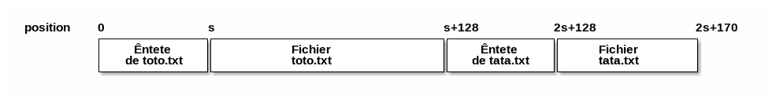

# Consignes générales pour le TP

## Implementation

Toutes vos réponses devront être rédigées dans le fichier `answers.c`,
dans les fonctions correspondantes.

Un exemple de `main` est fourni dans `main.c`. Aucune modification de
`main.c` n'est prise en compte par les tests automatiques.  Utilisez
`main.c` pour tester manuellement votre programme.

## Autoévaluation

Pour effectuer les tests automatiques et obtenir une estimation de
votre note, vous devez lancer `make test`.

Le fait que les test soient validés ne garantit pas la correction de
votre code de manière absolue ; il y a toujours la possibilité d'un
bug que les tests n'arrivent pas à faire apparaître. Il s'agit d'un
premier retour sur votre travail qui peut vous être utile pour
vérifier que vous avez atteint les objectifs du TPs.

Si vous ne comprenez pas le résultat ou l'affichage d'un test, vous
pouvez toujours consulter son code dans `test_cases/testN.c`, avec `N`
le numéro du test.

# Exercice 1

Il s'agit d'un exercice très facile qui permet de prendre confiance
avec l'environnement de programmation et l'interface POSIX.

## Question 1 : cat

Écrire la fonction

    int affiche_file(char *filename);

qui affiche sur le terminal le contenu du fichier avec nom "filename".
Si le fichier n'existe pas, la fonction retourne -1; en cas de
success, la fonction retourne 0.

En écrivant la fonction, voud devez utiliser seulement les appels
système suivants :

-   `open()`
-   `read()`
-   `close()`

**ATTENTION** : Pour afficher une chaîne de caractères sur le terminal,
utilisez la fonction `write()` sur le descripteur de fichier
`TEST_FILENO`, sinon les test ne passeront pas !  Par exemple:

    int nw = write(TEST_FILENO, etc....); 

Dans le main, `TEST_FILENO` est la même chose que `STDOUT_FILENO` ;
dans l'environnement de test, `TEST_FILENO` redirigera la sortie sur
un fichier nommé `__TEST_FILE__`.

## Question 2 : sequence de nombres

Écrire la fonction

    void ecris_tableau(int nums[], int n, char *filemane);

qui écris les `n` entiers contenus dans le tableau `nums` dans le
fichier `filename`.

Le fichier doit avoir un format "binaire" : les entiers seront
representés dans le fichier selon leur format binaire, c'est à dire 4
octets par entier. 

En écrivant la fonction, vous pouver utiliser les appels système
(open, write, etc.) ou bien les appels de la librairie standard C
(fopen, fwrite, fprintf, etc.).

Quelque point d'attention:

-   Un exemple d'utilisation de cette fonction se trouve dans le programme
    `write_int.c`. Compilez avec `make write_int`, ensuite lancez le
    programme et montrez le fichier `int.bin` avec le programme `vi` :
    
        vi int.bin
    
    Est-ce que vous reconnaissez les nombres écrites ? Pourquoi ?
    Pouvez-vous dire comment les entiers sont representés dans ce fichier ?

-   Pour voir le contenu octet par octet, utilisez la commande
    
        hexdump -C int.bin
    
    Est-ce que vous reconnaissez les nombres maintenant ?

-   Pour calculer la taille de ce fichier tapez : 
    
        stat int.bin
    
    Quel est le resultat ?

## Question 3 : sequence de caractères ascii

Écrire la fonction:

    void ecris_tableau_ascii(int nums[], int n, char *filemane);

qui écris les `n` entiers contenus dans le tableau `nums` dans le
fichier `filename` en format "texte" : les entiers seront representé
comme sequences de caractères ascii dans le fichier, un entier par
ligne. Par exemple, si le tableau contient les trois entiers 35, 42,
71, le fichier "int.txt" doit avoir le contenu suivant :

    35
    42
    71

(avec un retour à la ligne après chaque entier).  Vous pouvez utiliser
les appels systèmes ou les appels de librairie standard. Pour
convertir un entier dans sa representation en sequence de caractères
vous pouvez utiliser par exemple la fonction `sprintf()` (mais d'autre
fonctions existent).

-   Pour voir le contenu du fichier octet par octet, utilisez la
    commande
    
        hexdump -C int.txt
    
    Comparez les codes affichés avec les codes ascii, en utilisant par
    exemple ce tableau de correspondance:
    
    <https://en.wikipedia.org/wiki/ASCII>

# Exercice 2

Une *archive* est un fichier qui contient d'autres fichiers dans un
format spécifique. Dans cet exercice, on s'intéresse à une version
simplifiée du format tar, qu'on appellera `pdsar` pour `PDS archive`.

Une archive contient une séquence de fichiers, chacun précèdé d'un
entête :

    struct header {
       char name[PATH_MAX]; // chemin relatif du fichier
       int size;            // taille en octets
    };

Par exemple, considérez l'archive `myarchive.pdsar` qui contient 2
fichiers, `toto.txt` de 128 octets, et `tata.txt` de 42 octets. Le
fichier `myarchive.pdsar` est structuré de la manière suivante :

-   Tout d'abord, on trouve un entête de taille `s = sizeof(struct header)`
    qui contient les informations sur le fichier `toto.txt` (chemin et
    taille) ;
-   ensuite, on trouve le 128 octets du fichier `toto.txt` ;
-   ensuite, on trouve une deuxième entête de taille `s = sizeof(struct
      header)` qui contient les informations sur le fichier `tata.txt` ;
-   enfin, on trouve le 42 octets du fichier `tata.txt`.

La structure de l'archive est resumé dans la figure suivante (`s` est
égale à `sizeof(struct header)`).

Ce format permet de mémoriser un nombre arbitraire de fichiers dans un
seul fichier archive. Dans cet exercice, il s'agit de mettre en oeuvre
les fonctions pour manipuler un tel format de fichier.

## Question 1

Écrire le code de la fonction `list_archive(const char *archive_name)`
qui affiche la liste de tous les fichiers contenus dans un fichier
`archive_name()`. Pour chaque fichier contenu dans l'archive, la
fonction doit afficher seulement son nom. Par exemple, pour
`myarchive.pdsar`, la fonction doit afficher :

    toto.txt
    tata.txt

Si le fichier `archive_name` n'existe pas, la fonction n'affiche rien
et retourne -1.

**ATTENTION** : Pour afficher une chaîne de caractères, utilisez la
fonction `output_str(char *)`, sinon les test ne passeront pas !

## Question 2

Pour optimiser la recherche d'un fichier dans l'archive, nous allons
mémoriser les positions (offsets) des entêtes des fichiers dans un
tableau. Nous utiliserons la structure suivante :

    struct loffsets {
        int n_files;             // nombre de fichiers dans l'archive
        off_t offset[MAX_FILES]; // positions des entêtes
    };

Écrire le code de la fonction `generate_offsets(const char
*archive_name, struct loffsets *lo)` qui ouvre l'archive
`archive_name` et parcourt son contenu, en mémorisant les positions
dans la structure pointée par le paramètre `lo`.

La fonction retourne -1 si l'archive n'existe pas ou s'il contient
plus de `MAX_FILES` fichiers. La fonction mémorise dans la i-ème case
du tableau la position du début de l'entête correspondant à l'i-ème
fichier, et dans le champ `n_files` le nombre des fichiers archivés.

Par exemple, supposant que la valeur de `s` est égale à 132 octects,
le champ `n_files` de la structure offset doit être égale à 2, et le
champ `offset[]` contiendra les valeurs 0 et 260=132+128.

## Question 3

Écrire le code de la fonction `print_file(const char *archive_name,
struct loffsets *lo, int n)` qui affiche le n-ieme ficher contenu dans
l'archive. Cette fonction utilise la structure `lo` pour afficher
seulement le contenu du n-ième fichier sans besoin de parcourir tout
l'archive. Si l'archive n'existe pas, la fonction n'affiche rien et
retourne -1. Si l'archive contient mois de `n+1` fichiers, ou si `n` est
negative, la fonction retourne -2. 

**ATTENTION** : Pour afficher le contenu d'un tableau d'octets, utilisez
la fonction `output_bytes(char *, int n_octets)`.

## Question 4

Écrire le code de la fonction `add_file(const char *archive_name,
const char *filename)` qui ajoute le fichier `filename` dans l'archive
en dernière position. La fonction retourne -1 si le fichier `filename`
ou le fichier `archive_name` n'existent pas.

